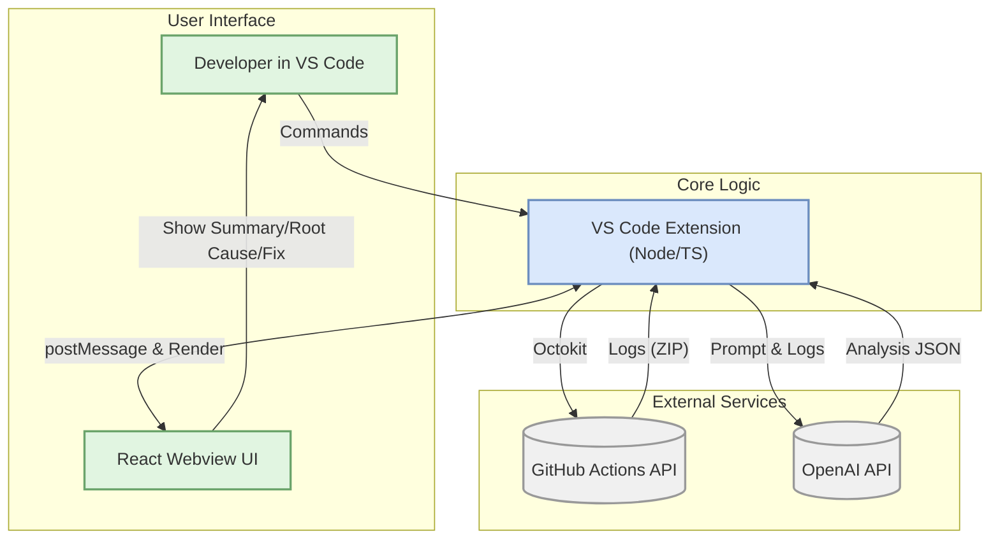
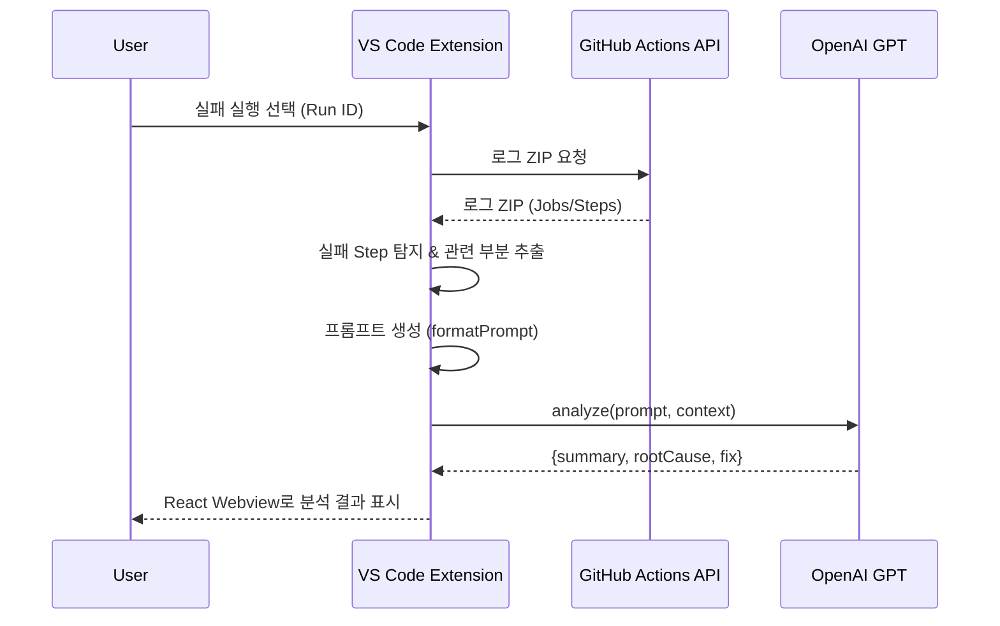

# MAD: GitHub Actions Analyzer (VS Code Extension)
   [](#-license)

> **한 줄 소개**  
> **MAD**는 GitHub Actions 실패 로그를 자동으로 모아 **요약·원인·해결책**을 AI로 생성해 **VS Code 안에서 즉시** 보여주는 디버깅 도우미입니다.

---

## 📌 개발 배경 및 목적

OSS GitHub Actions Analyzer VS Code Extension **MAD**는 GitHub Actions에서 CI/CD 워크플로우가 실패했을 때 개발자들이 직면하는 디버깅의 어려움을 해결하기 위해 개발되었습니다. 방대한 로그 파일을 수동으로 파싱하여 워크플로우 실패의 근본 원인을 찾는 긴 과정을, 인공지능과 자연어 처리 기능을 활용해 자동화하여 빌드 지연과 배포 실패로 인한 리스크를 낮추고 개발자가 본질적인 문제 해결에 집중하도록 돕습니다.

---

## ✨ 주요 기능 상세

<details>
<summary><strong>1. GitHub 연동 및 레포지토리 설정</strong></summary>

VS Code에 내장된 GitHub 인증을 사용하여 안전하게 GitHub 계정과 연동하고, 분석할 레포지토리를 손쉽게 설정합니다.

- **`src/auth/githubSession.ts`**: VS Code의 Authentication API를 통해 GitHub 세션을 얻고, API 호출을 위한 Octokit 클라이언트를 생성합니다.
  ```typescript
  // src/auth/githubSession.ts
  export async function getOctokitViaVSCodeAuth(): Promise<Octokit | null> {
    const session = await vscode.authentication.getSession(
      'github',
      ['repo', 'workflow'],
      { createIfNone: true }
    );
    if (!session) return null;
    return new Octokit({ auth: session.accessToken });
  }
  ```
- **`src/github/getRepoInfo.ts`**: 사용자가 입력한 `owner/repo` 정보를 VS Code 전역 상태에 저장하여 관리합니다.
  ```typescript
  // src/github/getRepoInfo.ts
  export async function promptAndSaveRepo(context: vscode.ExtensionContext): Promise<RepoRef | null> {
    const value = await vscode.window.showInputBox({
      prompt: '저장할 GitHub 레포를 입력하세요 (owner/repo 또는 GitHub URL)',
      // ...
    });
    if (!value) return null;

    const parsed = parseOwnerRepo(value)!;
    await context.globalState.update('gh_actions_analyzer.fixed_repo', `${parsed.owner}/${parsed.repo}`);
    vscode.window.showInformationMessage(`✅ 레포 저장됨: ${formatRepo(parsed)}`);
    return parsed;
  }
  ```

</details>

<details>
<summary><strong>2. 워크플로우 실행 및 로그 분석</strong></summary>

React 기반의 웹뷰 UI를 통해 워크플로우 목록과 실행 기록을 확인하고, 실패한 실행을 선택하여 분석을 요청할 수 있습니다.

- **`src/webview-react-app/src/api/github.ts`**: 프론트엔드(웹뷰)에서 백엔드(확장)로 `postMessage`를 통해 API를 요청합니다.
  ```typescript
  // src/webview-react-app/src/api/github.ts
  export const analyzeRun = (runId: string) => {
    if (!vscode) {
      console.warn('Not in a VSCode environment, skipping analyzeRun.');
      return;
    }
    vscode.postMessage({
      command: 'analyzeRun',
      payload: { runId },
    });
  };
  ```
- **`src/extension.ts`**: 웹뷰로부터 `analyzeRun` 메시지를 수신하면, 로그 처리 및 LLM 분석 파이프라인을 실행합니다.
  ```typescript
  // src/extension.ts
  panel.webview.onDidReceiveMessage(async message => {
    // ...
    switch (message.command) {
      case 'analyzeRun':
        // ...
        const { failedSteps, prompts } = await getFailedStepsAndPrompts(/* ... */);
        const analysis = await analyzePrompts(prompts);
        panel.webview.postMessage({
          command: 'llmAnalysisResult',
          payload: { runId, ...analysis }
        });
        break;
    }
  });
  ```

</details>

<details>
<summary><strong>3. AI 기반 실패 원인 분석</strong></summary>

실패 로그에서 핵심 내용을 추출하여 OpenAI의 GPT 모델에 전달하고, 구조화된 분석 결과를 받아옵니다.

- **`src/log/getFailedLogs.ts`**: GitHub API로 로그 ZIP 파일을 다운로드하고, 실패한 스텝(step)을 식별하여 분석에 사용할 프롬프트를 생성합니다.
  ```typescript
  // src/log/getFailedLogs.ts
  export async function getFailedStepsAndPrompts(
    // ...
  ): Promise<{ failedSteps: string[]; prompts: string[] }> {
    // 1) 실패 스텝 이름 수집
    const jobs = await octokit.actions.listJobsForWorkflowRun({ owner, repo, run_id });
    const failedSteps = jobs.data.jobs.flatMap(job =>
      (job.steps ?? []).filter(s => s.conclusion === 'failure').map(s => s.name ?? 'unknown')
    );

    // 2) 로그 ZIP 다운로드
    const zipRes = await octokit.request(/* ... */);
    const zip = await JSZip.loadAsync(zipRes.data as any);

    // 3) 파일별로 내용 읽어서 prompt 구성
    // ...
    return { failedSteps, prompts };
  }
  ```
- **`src/llm/analyze.ts`**: 생성된 프롬프트를 OpenAI API로 보내고, `summary`, `rootCause`, `suggestion`이 포함된 JSON 형식의 답변을 받도록 요청합니다.
  ```typescript
  // src/llm/analyze.ts
  export async function analyzePrompts(prompts: string[]): Promise<LLMResult> {
    const client = new OpenAI({ apiKey: process.env.OPENAI_API_KEY! });
    const chat = await client.chat.completions.create({
      model: "gpt-3.5-turbo",
      messages: [
        {
          role: "system",
          content:
            "너는 GitHub Actions 로그 분석 도우미야. " +
            "사용자가 준 로그를 읽고 아래 JSON 형식으로만 답해:\n\n" +
            "{\n" +
            '  "summary": "로그 전체 요약",\n' +
            '  "rootCause": "실패의 핵심 원인",\n' +
            '  "suggestion": "해결 방법"\n' +
            "}\n\n" +
            "설명이나 불필요한 말은 하지마. 무조건 JSON만 출력해."
        },
        { role: "user", content: prompts[0] }
      ],
      temperature: 0
    });
    // ...
    return JSON.parse(chat.choices[0].message?.content ?? "{}");
  }
  ```

</details>

---

## 🏛 시스템 아키텍처

### 1) 전체 흐름 (Mermaid Flowchart)



### 2) 분석 시퀀스 (Mermaid Sequence)



---

## 🚀 빠른 시작

### 사전 준비

- **Node.js ≥ 18**
- **VS Code ≥ 1.85**
- **GitHub Personal Access Token** (Actions 로그 열람 권한 권장: `repo`)
- **OpenAI API Key** (`OPENAI_API_KEY`)

### 1) 클론 & 설치

```bash
git clone https://github.com/teamMADops/oss-llm.git
cd oss-llm

# VS Code 확장(백엔드)
npm install

# Webview(프론트엔드)
cd src/webview-react-app
npm install
npm run build
```

### 2) 환경 변수 설정
프로젝트 루트에 `.env` 파일을 생성하고 아래 내용을 추가하세요.
```
OPENAI_API_KEY="sk-..."
```

### 3) 확장 실행 (개발 모드)

1. VS Code에서 이 저장소 폴더를 엽니다.
2. `Run and Debug` ▶️ **Launch Extension**를 실행합니다.
3. 새로 열린 **Extension Development Host** 창에서 아래 명령을 사용합니다.

### 4) 기본 명령 (Ctrl/Cmd + Shift + P)

- **MAD Ops: Set Repository** — 분석 대상 `owner/repo` 설정 (예: `octocat/Hello-World`)
- **MAD Ops: Open Dashboard** — 메인 대시보드 패널 열기
- **MAD Ops: Analyze GitHub Actions** — 실행 목록에서 실패 run 선택 → 자동 분석

--- 

## 📄 License

이 프로젝트는 MIT 라이선스를 따릅니다. 자세한 내용은 [LICENSE](LICENSE) 파일을 참고하세요.
